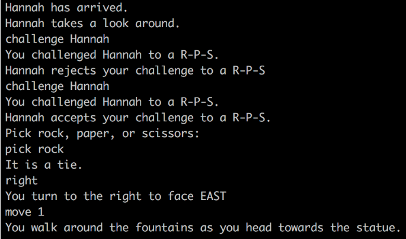
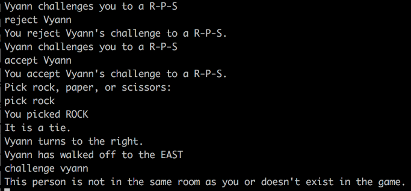

# PvP Rock Paper Scissors Battles

### Playing R-P-S:
#### As a Users:
After users have enter into a game, users can see a list of commands. To play rock, paper, scissors with someone, use the commands listed her:
* Challenge <enter_player_name>
* Accept <enter_player_name>
* Reject <enter_player_name>
* Pick <enter_rock_paper_scissors>

One important note is that when you want to challenge someone to a rock, paper, scissors, you both need to be in the same room or else it would return a messag saying that the person you challenged is not in the same room as you. Another note is that when using command "pick", the only option users can enter is rock, paper, or scissors. The basic R-P-S rules applies to this game, which means rock beats scissors, scissors beats paper, and paper beats rock. Here is an example of Vyann challenging Hannah to rock, paper, scissors:

####As a Developers:
When the suer enter the command "challenge", "accept", "reject", or "pick", the following methods in GameObject are being call on the client's side:
* public String challenge(String challenger, String challengee)
* public String accept(String challenger, String challengee)
* public String reject(String challenger, String challengee)
* public String pick(String challenger, String challengee)
These methods will then go to the server side in GameCore. The functionality of each method listed above are almost the same. When the "challenge", "accept", "reject", or "pick" is being called, it will check for three things. It will check if:
1. All players are in the game
2. Challenger is in the same room as challengee
3. Challenger or challengee are already in a R-P-S battle
If any of the above applies, return a message telling why users are not able to challenge someone to a R-P-S. Otherwise, returns a message saying that someone has challenged them to a R-P-S battle, accepted their challenge or rejected their challenge. 
As for the "pick" method, it checks what input the user enter. If the input is not rock, paper, scissors, return a message saying it is an invalid option. If it is a valid option, it will then compare the challenger's option to the opponent's option. Then it will compare the option and return a message to btoh users saying who won.

